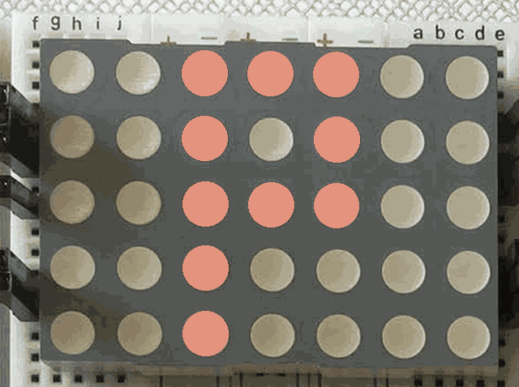
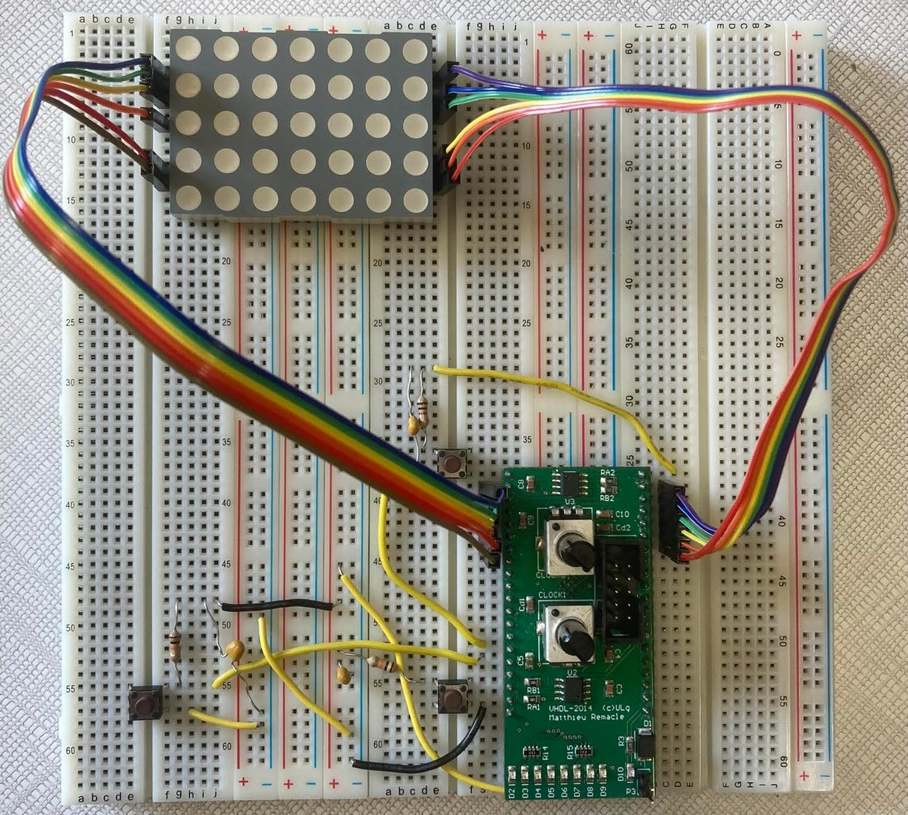
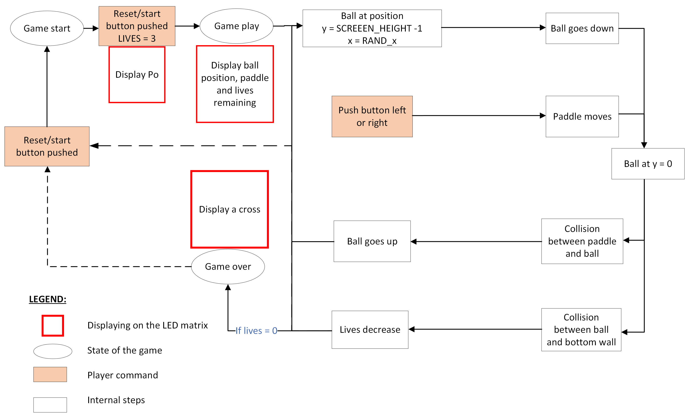
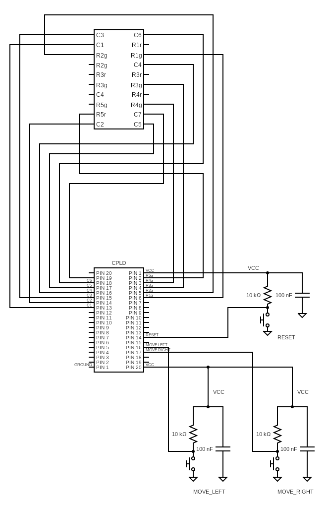
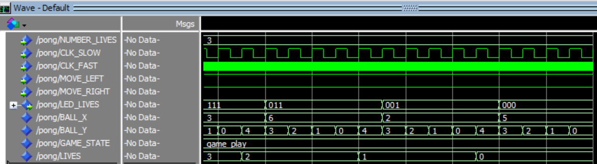

# CPLD Pong in VHDL

A hardware-constrained Pong-inspired game implemented in VHDL on a CPLD and displayed on a 5x7 bi-color LED matrix.

<p align="center">
  
</p>

## Project Overview

This project implements a simplified Pong game on a CPLD using VHDL. The game uses one horizontally controlled paddle, one vertically moving ball, three lives, and a 5x7 bi-color LED matrix as the display. The design was adapted to fit the limited resources of the target CPLD, which provides only 160 logic gates, while still supporting gameplay, collision handling, pseudo-random ball repositioning, and start/reset control. The full technical report is available in [report.pdf](report.pdf).

## Repository Structure

```text
.
├── README.md             # Project overview and results
├── .gitignore            # Files ignored by Git
├── .gitattributes        # Git attributes configuration
├── pong.vhd              # Main VHDL implementation
├── report.pdf            # Full project report
├── assets/               # Demo and README images
└── report/               # LaTeX report source and figures
```

## Results Summary

| Result | Value |
|---|---:|
| Logic gates used | 94 / 160 |
| CPLD capacity used | 59% |
| Pins used | 20 / 54 |
| Game lives validated | 3 to 0 |
| Display size | 5x7 LEDs |

### Hardware Prototype

<p align="center">
  
</p>

Hardware prototype on breadboard.

### Game Structure

<p align="center">
  
</p>

Game structure: start, play, collision handling, lives, and game-over flow.

### Electrical Schematic

<p align="center">
  
</p>

Electrical schematic connecting the CPLD, control buttons, and LED matrix.

### Simulation Validation

<p align="center">
  
</p>

ModelSim simulation validating the lives counter from 3 to 0.

## Authors

- Grégoire Hendrix
- Louis Hogge
- Arnaud Innaurato
- Macha Krumm
